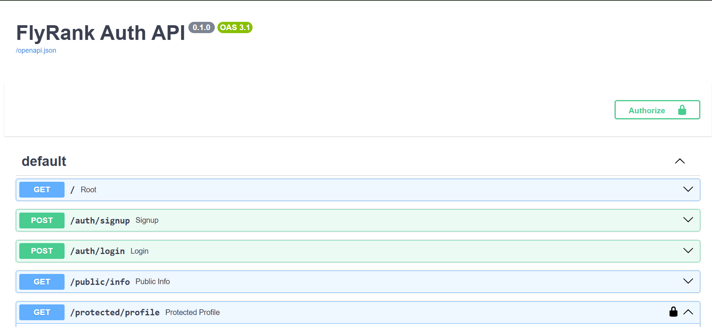

# FlyRank Auth API

A secure FastAPI backend built for the FlyRank Internship (BE-03, Auth · Login & protect). It handles user
sign up, log in, and log out using [Supabase Auth](https://supabase.com/docs/guides/auth) as the identity
provider, verifies JSON Web Tokens on protected routes via a reusable dependency guard, and documents the
whole flow in Swagger UI with bearer authentication.

No passwords are hashed or stored by this project — Supabase handles that. This API only ever forwards
credentials to Supabase and verifies the tokens Supabase issues.

## Setup

1. Clone the repo and `cd` into this folder:
```bash
   git clone https://github.com/faizan102418/FlyRank-AI-Internship.git
   cd FlyRank-AI-Internship/Auth
```

2. Copy `.env.example` to `.env` and fill in your own Supabase project values:
```bash
   cp .env.example .env
```

SUPABASE_URL=your_project_url
SUPABASE_KEY=your_anon_key
PORT=8000

Get these from your Supabase Dashboard under **Project Settings → API** (use the **anon/public** key,
   never `service_role`).

3. Install dependencies with [uv](https://docs.astral.sh/uv/):
```bash
   uv sync
```

## Run

```bash
uv run uvicorn main:app --reload --port 8000
```

The server starts at `http://localhost:8000`. Interactive API docs (Swagger UI) are available at
`http://localhost:8000/docs`.

## Endpoints

| Method | Path                   | Description                     | Auth required |
|--------|------------------------|----------------------------------|----------------|
| GET    | `/`                    | Health check                    | No             |
| POST   | `/auth/signup`         | Create a new user account       | No             |
| POST   | `/auth/login`          | Log in, returns access token    | No             |
| GET    | `/public/info`         | Public, open data                | No             |
| GET    | `/protected/profile`   | Read the authenticated user's profile | Yes (Bearer token) |
| GET    | `/protected/dashboard` | Example second protected route, proves the guard is reusable | Yes (Bearer token) |
| POST   | `/auth/logout`         | End the current session          | Yes (Bearer token) |

All protected routes expect an `Authorization: Bearer <access_token>` header, using the token returned by
`/auth/login`.

## Swagger UI with bearer auth

`/docs` shows a lock icon on every protected route. Click **Authorize**, paste an access token (no need to
type "Bearer " — FastAPI adds that), and use **Try it out** to call protected endpoints directly from the
browser.



## Status codes

| Code | Meaning                                              |
|------|-------------------------------------------------------|
| 200  | Successful read / login                               |
| 201  | User created (signup)                                 |
| 204  | Logout succeeded, no content returned                 |
| 400  | Missing required fields in the request body            |
| 401  | Missing, malformed, invalid, or expired token          |

## Notes

- Email confirmation is disabled on this Supabase project for local testing convenience. In a production
  setting this would stay enabled.
- Token verification happens via a single reusable FastAPI dependency (`get_current_user`), applied to every
  protected route — see `main.py`.