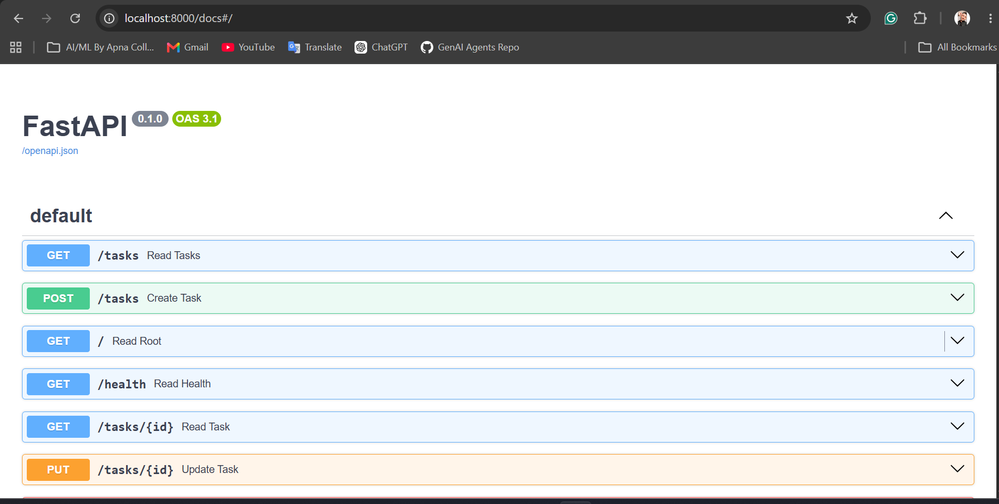
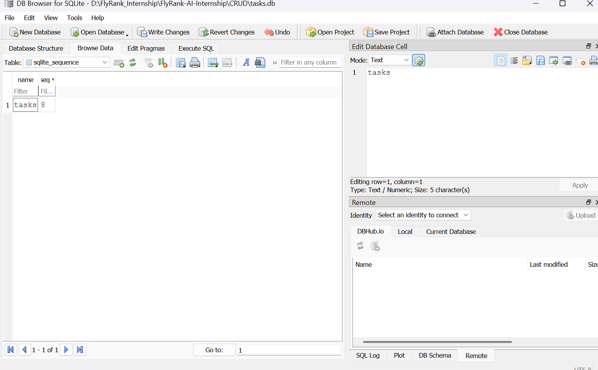

# Task Management API (FlyRank AI Internship - Week 2)

A robust, lightweight Task Management RESTful API built with **FastAPI** and run via **Uvicorn**. This project implements full CRUD (Create, Read, Update, Delete) functionality with robust, custom input validation to handle tricky edge cases.

---

## Features

- **Full CRUD Support:** Smoothly manage task resources (`GET`, `POST`, `PUT`, `DELETE`).
- **Input Validation:** Custom validation to catch empty inputs, blank spaces, and invalid requests (returns `400 Bad Request`).
- **Auto-Documented:** Fully self-documenting interface using FastAPI's integrated Swagger UI.
- **In-Memory Storage:** Faster operational performance with structured local lists.

---

## Technology Stack

- **Framework:** FastAPI
- **ASGI Server:** Uvicorn
- **Language:** Python 3.x
- **Environment:** virtualenv

---



## Installation & Setup

Follow these quick steps to get the API running locally on your machine.

### 1. Clone the Repository
```bash
git clone [https://github.com/faizan102418/FlyRank-AI-Internship.git](https://github.com/faizan102418/FlyRank-AI-Internship.git)
cd FlyRank-AI-Internship/week2_assingment

# Create a virtual environment
python -m venv venv

# Activate the virtual environment
# On Windows:
venv\Scripts\activate
# On macOS/Linux:
source venv/bin/activate

pip install fastapi uvicorn

uvicorn main:app --reload

```


## Database

This project stores tasks in **SQLite** instead of an in-memory list.

**Why SQLite:** no server to install or configure — the whole database
is a single file (`tasks.db`). It's created automatically the first time
the app runs, and data survives a server restart, which an in-memory list
cannot do.

**Where it lives:** `tasks.db`, created automatically in the project root.
It's git-ignored, so a fresh clone starts with no database file — the app
creates it and seeds three example tasks on first run.

**Run it:**



## Running with Docker Compose

This project runs the API and a PostgreSQL database as two containers,
started together with a single command.

**Setup:**
1. Copy `.env.example` to `.env`
2. Run:


The API will be available at `http://localhost:8000`. Postgres data
persists in a named Docker volume (`taskdata`), so it survives
`docker compose down` and `docker compose up` cycles.

docker compose up

## Endpoints

| Method | Path          | Description          |
|--------|---------------|-----------------------|
| GET    | /tasks        | List all tasks        |
| GET    | /tasks/{id}   | Get one task          |
| POST   | /tasks        | Create a task          |
| PUT    | /tasks/{id}   | Update a task          |
| DELETE | /tasks/{id}   | Delete a task          |

**Example:**

curl -i http://localhost:8000/tasks

HTTP/1.1 200 OK
[{"id":1,"title":"Buy milk","done":false}, ...]