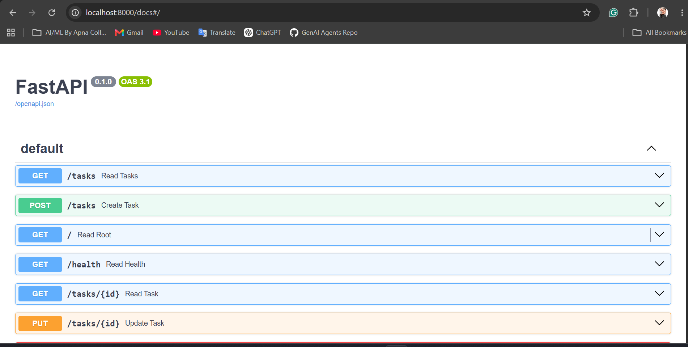

# Task Management API (yRank AI Internship - Week 2)

A robust, lightweight Task Management RESTful API built with **FastAPI** and run via **Uvicorn**. This project implements full CRUD (Create, Read, Update, Delete) functionality with robust, custom input validation to handle tricky edge cases.

---

## Features

- **Full CRUD Support:** Smoothly manage task resources (`GET`, `POST`, `PUT`, `DELETE`).
- **Input Validation:** Custom validation to catch empty inputs, blank spaces, and invalid requests (returns `400 Bad Request`).
- **Auto-Documented:** Fully self-documenting interface using FastAPI's integrated Swagger UI.
- **In-Memory Storage:** Faster operational performance with structured local lists.

---

## Technology Stack

- **Framework:** FastAPI
- **ASGI Server:** Uvicorn
- **Language:** Python 3.x
- **Environment:** virtualenv

---



## Installation & Setup

Follow these quick steps to get the API running locally on your machine.

### 1. Clone the Repository
```bash
git clone [https://github.com/faizan102418/FlyRank-AI-Internship.git](https://github.com/faizan102418/FlyRank-AI-Internship.git)
cd FlyRank-AI-Internship/week2_assingment

# Create a virtual environment
python -m venv venv

# Activate the virtual environment
# On Windows:
venv\Scripts\activate
# On macOS/Linux:
source venv/bin/activate

pip install fastapi uvicorn

uvicorn main:app --reload

